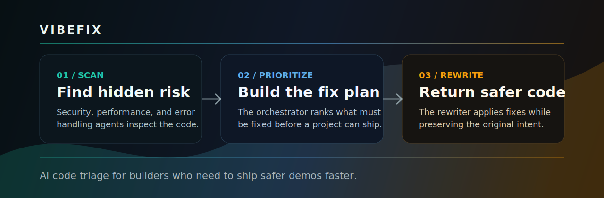
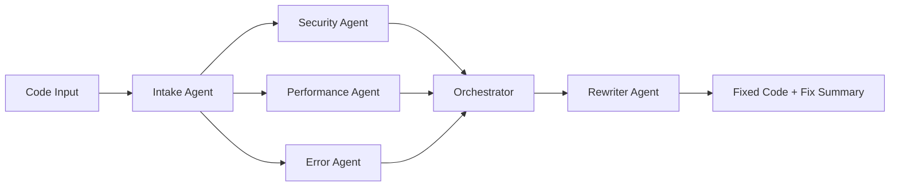

# VibeFix



[](https://www.python.org/)
[](https://ai.google.dev/)
[](#demo)

VibeFix is an AI-powered code repair pipeline for hackathon builders who move fast, paste messy code, and need a second set of engineering eyes before they ship. It analyzes a code sample, finds security, performance, and error-handling risks, prioritizes the fixes, then rewrites the code with safer production-ready patterns.

## Why It Matters

Hackathon projects often work in the demo but hide risky shortcuts: hardcoded secrets, SQL injection, missing validation, no error handling, and code that will buckle under real users. VibeFix turns that last-minute cleanup into a guided AI workflow.

## What It Does

- Detects the language, framework, complexity, database usage, auth usage, and environment-variable needs.
- Runs specialist agents for security, performance, and error-handling review.
- Combines findings into one prioritized fix plan.
- Rewrites the original code while preserving its intent.
- Includes a polished HTML demo experience for judging and presentation.

## Agent Pipeline



## Demo

Open the visual demo:

```bash
python -m http.server 5177
```

Then visit:

```text
http://127.0.0.1:5177/VibeFix.html
```

Run the Python agent pipeline:

```bash
python -m venv .venv
.venv\Scripts\activate
pip install -r requirements.txt
copy .env.example .env
```

Add your Gemini API key to `.env`:

```env
GEMINI_API_KEY=your_api_key_here
```

Then run:

```bash
python main.py
```

## Repository Structure

```text
VibeFix/
  agents/
    intake_agent.py          # Creates the code manifest
    security_agent.py        # Finds vulnerabilities and risky patterns
    performance_agent.py     # Finds scalability bottlenecks
    error_agent.py           # Finds fragile error handling
    orchestrator_agent.py    # Prioritizes every finding
    rewriter_agent.py        # Applies the fix plan
  models/
    manifest.py              # Shared manifest dataclass
  VibeFix.html               # Interactive judge-facing demo
  main.py                    # End-to-end pipeline runner
  requirements.txt
  .env.example
```

## Built For Judges

VibeFix is designed to be easy to evaluate:

- Clear problem: AI-generated and rushed code often ships with hidden production risks.
- Clear workflow: scan, rank, repair.
- Clear technical split: each agent owns one engineering concern.
- Clear demo path: use `VibeFix.html` for the visual story and `main.py` for the working pipeline.

## Tech Stack

- Python
- Google Gemini API
- HTML, CSS, and React via CDN for the demo
- Dataclass-based report models

## Environment

The project expects one secret in `.env`:

```env
GEMINI_API_KEY=
GEMINI_MODEL=gemini-2.5-flash-lite
```

Do not commit real API keys.

## Future Scope

- Upload an entire repository instead of one pasted code sample.
- Return patch files or pull requests automatically.
- Add language-specific static checks before calling the AI agents.
- Add a backend API so the HTML demo can call the live pipeline.
